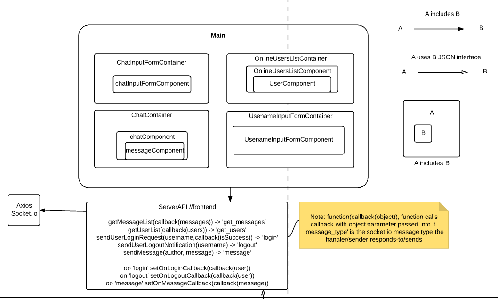
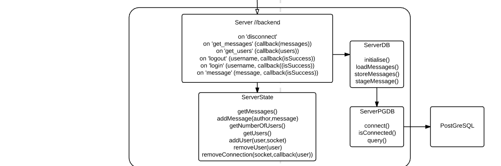

# Chat Server

[](https://travis-ci.org/t-rappos/auction-system)

This application was created to test a proposed technology stack for web applications.
It was also successfully deployed on [heroku](https://chat-server-t-rappos.herokuapp.com/#/?_k=32gzvg)


## Features
- User can set name.
- User can see list of online users.
- User can post messages.
- User can see an up-to-date list of messages.
- Application runs in real-time without needing webpage refreshes.

## Technology Stack

### Front-end
- React
- Redux
- Socket.io
- Babel
- Webpack

### Back-end
- Node.js
- Express

### (Continuous) Deployment
- Github (pushes to chat-server branch and runs)
  - Travis-CI (if this passes)
    - Heroku (deployed)

### Testing
- karma
  - spawns webserver and runs tests in browser
- mocha
  - javascript test framework
- jquery
  - for inspecting the DOM
- expect
  - better syntax and functionality for making test assertions.


Tests were created for all of the React components
Things that were tested in general include:
- Component renders in DOM with minimal amount of input
- Component throws error if required property is not passed (crashes are better than silent errors as we can see issues imediately)
- Component renders as expected with input specified

Noteable changes to codebase to enable testing:
- Calls to ServerApi within the components were abstracted out by setting new component callback properties to the existing serverApi calls within the main file. This is good as now only main.jsx needs reference to the serverApi.jsx file. This was done because of difficulties including serverApi.jsx as it uses socket.io which was causing test compilation issues.

TODO:
  - Explore how to test ServerAPI and redux containers
  - Explore how to test back-end server.js and serverState

### Linting
- ESLint

https://shellmonger.com/2016/01/26/using-eslint-with-webpack/
https://www.npmjs.com/package/eslint-plugin-react

- setup to lint jsx files when webpack runs
- TODO: will this work with deployment? or do we need to automate with gulp?
  - idealy it should break the build if a lint error occurs and thus not deploy


### Continuous Integration
- Has been setup with travis-ci
- Runs test suite every push to github
- Heroku pulls code whenever a git-push successfully passes travic-ci checks

### Package.json

```
"dependencies": {
  "babel-plugin-transform-class-properties": "^6.19.0",
  "babel-plugin-transform-runtime": "^6.15.0",
  "babel-polyfill": "^6.20.0",
  "babel-register": "^6.18.0",
  "body-parser": "^1.15.2",
  "dateformat": "^2.0.0",
  "jquery": "^3.1.1",
  "pg": "^6.1.2",
  "react": "^15.4.2",
  "react-dom": "^15.4.2",
  "react-redux": "^5.0.2",
  "react-router": "^2.0.0",
  "redux": "^3.6.0"
},
"devDependencies": {
  "babel-core": "^6.21.0",
  "babel-loader": "^6.2.10",
  "babel-preset-es2015": "^6.18.0",
  "babel-preset-react": "^6.5.0",
  "babel-preset-stage-0": "^6.16.0",
  "css-loader": "^0.26.1",
  "eslint": "^3.14.0",
  "eslint-config-google": "^0.7.1",
  "eslint-loader": "^1.6.1",
  "eslint-plugin-react": "^6.9.0",
  "expect": "^1.20.2",
  "express": "^4.14.0",
  "foundation-sites": "^6.3.0",
  "karma": "^1.4.0",
  "karma-chrome-launcher": "^2.0.0",
  "karma-firefox-launcher": "^1.0.0",
  "karma-mocha": "^1.3.0",
  "karma-mocha-reporter": "^2.2.1",
  "karma-sourcemap-loader": "^0.3.7",
  "karma-webpack": "^2.0.1",
  "mocha": "^3.2.0",
  "react-addons-test-utils": "^15.4.2",
  "script-loader": "^0.7.0",
  "socket.io": "^1.7.2",
  "socket.io-client": "^1.7.2",
  "style-loader": "^0.13.1",
  "webpack": "^1.14.0"
}
```
TODO: Check if all the non-dev dependancies are needed
## Design

### Front-end React Component Tree

This image displays the react components and the props being sent to children components.

### System Design



### Front-end Redux diagram

