# Technical Design Document

TODO: how to explicitly link SRS to TDD and then create tickets for development?

http://www.in.gov/fssa/files/QualCheck.pdf
http://www.engr.sjsu.edu/gaojerry/course/131/SampleProjects/Design_Doc.pdf

## Abstract
This document is aiming to explain the static and dynamic structure of the systems architecture. Focus will be on explaining these details abstractly, and without much explanation in terms of implementation details e.g. programming language or frameworks.

## Problem Analysis
### Goals, Benefits, Objectives
- Goal is to gain experience working with multiple systems

### Description of requirements
- User can create an account to interact with the system (logging in/out) and call also message other accounts.
- User can create items, which are then stored in the users inventory. Inventories can be sorted and searched. Items can be inspected to see their metadata.
- User can list singular items for sale as a bid and/or a buyout listing. They can also cancel listings. Users will be alerted by a message when an item is sold.
- User can search all listed items using item metadata as search criteria. They can also create on-going searches which will display items as they are listed in real time if they match criteria (deferred). The search results can be sorted. Item-type price can be observed over time (deferred).

### Assumptions
### Simplifications

## Systems Overview
### Diagram

TODO: Update this to reflect technologies research page
### Justification

## Back-End
### Data Model V1

https://www.lucidchart.com/documents/edit/299c93a7-91aa-4bd3-b2d2-2c8fcfa3b7c4#
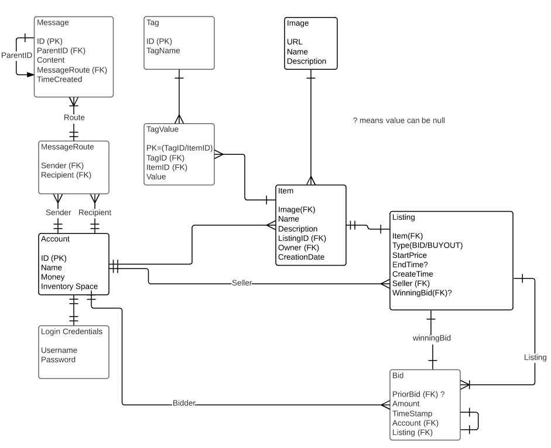

### Data Model V2

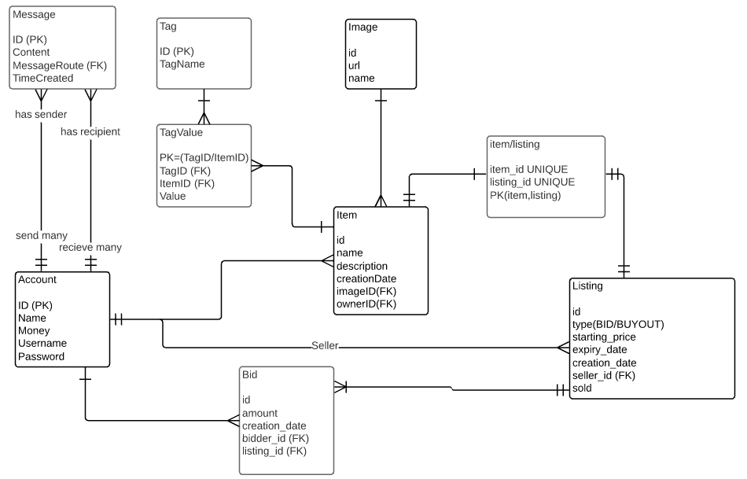

#### Explanation
The V2 model has been simplified by removing MessageRoute and LoginCredentials. It also allows items to be relisted multiple times. Messages no longer have a prior message, and bids no longer have a prior bid.

TODO:
- EAV may be an anti pattern...
 https://mikesmithers.wordpress.com/2013/12/22/the-anti-pattern-eavil-database-design/

### ServerAPI

note: response messages are named `[message_name]_response`

Message | Data sent with message | Data sent as response
--- | --- | ---
connect         | (socket) |
disconnect  

    | (socket) |
--- | --- | ---
create_account          |(email, username, password) |(account)
validate_new_username   |(username)                  |(success)

validate_new_email      |

(email)                     |(success)
update_account          |(username, account_details) |(success)
--- | --- | ---
get_account_details

    |(username) |(account_details)
get_account_messages   |(username) |([message...])
set_message_read       |(message)
login_user             |(username,password,socket)

 |(success)
logout_user            |

(username) |(success)
send_message           |

(author,recipient,title,message) |(success)
autocomplete_username  |(input)

 |(suggestion_list)
verify_username_exists

 |(username) |(success)
--- | --- | ---
create_item          |(imageId, name, description, tagValues, ownerId)

|(item)
get_image_list

   | |(image_list)
get_account_items      |(username)

 |(item_list)
get_item_image

       |(item) |(image)
remove_item

         |(item) |(success)
--- | --- | ---
create_item_tag_value |(tag_name) |(tagValue)
get_tag_enum_values | (tag_name) | ([tagValue...])
get_all_tags

 | |([tag...])
--- | --- | ---
get_all_listings  |

 |([listing...])
get_account_listings |

(username) |([listing...])
create_listing | (itemId, startPrice, duration, type, sellerId) | (listing)
bid_on_listing

     |(user,listing,price) |(success)
buyout_listing    |

(user,listing) |(success)
cancel_listing     |

(listing) |(success)

## V1
### Candidate Classes

#### List
- ClientAPI
- ServerAPI
- AccountAPI
- SessionAPI
- ListingAPI
- ItemAPI
- User
- MessageFactory
- Message
- AccountFactory
- Account
- ListingFactory
- Listing
- TransactionFactory
- TransactionBid
- TransactionPurchase
- ItemFactory
- Item
- TagFactory

#### Diagrams

##### Entity-Factory Pattern
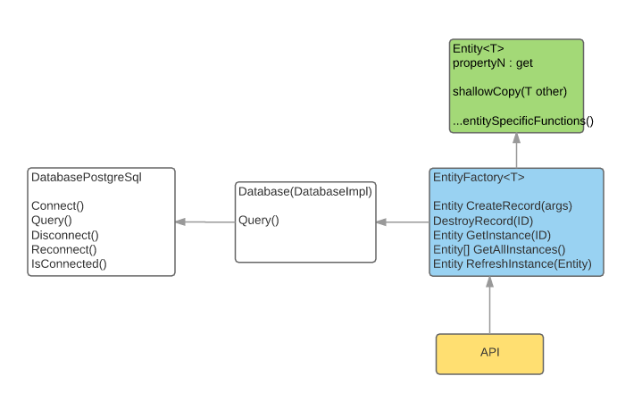

To deal with database records, an entity-factory design will be used.

`Factory<T>`: (Depends on `Entity<T>`)
- CRUD manipulator for database entity records.
- Knows how to use a database.
- Knows how to alter an entity using the database.
  - An instantiated `Entity<T>` object is reloaded from the database if its record is changed.
- Knows how to convert a database record into an `Entity<T>` object.
- Can only be a single factory for each entity type (Singleton)

`Entity<T>`:
- An object representation of a database record.
- Doesn't depend on `Factory<T>`. Accesses factory functionality via dependancy injection when the entity is created. E.G. functions are passed down and binded.
- Doesn't know anything about the underlying database or record.
- Idealy the state of an instantiated Entity<T> will always be equal to its database record state.
  - Has properties that can be 'get' but not 'set'.
  - Has methods that can modify the entity but call the factory to perform operations on the entities record, after which, the Entity<T> is reloaded. These methods are injected.

`API`:
- Is a singleton
- Knows how to use a factory and its entity


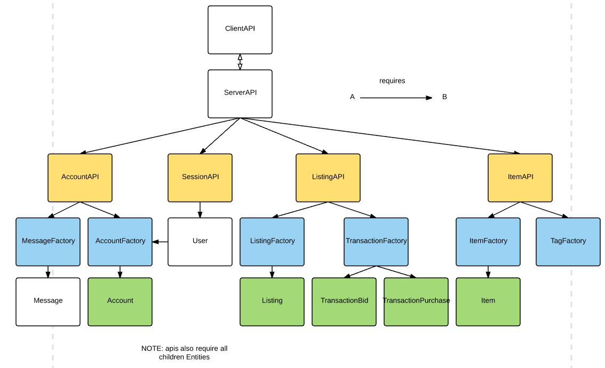

#### Justification
- How it works:
- object orientated vs procedural:
  - the data is organised relationally, which makes implementing a full OO design difficult
  - do not want to duplicate state in the OO design as the state is maintained in the DB
- expected things that can change, and contingencies:
  - front end
    - socket IO messages, text interface makes it easy to replace front end
  - database
    - Factories will rely on an abstracted database, so the database implementation can be changed without effecting the factories.

## V2

### Candidate Class List
- API.js //Might refactor this into smaller parts
- Facade
  - account.js
  - item.js
  - listing.js
  - tag.js
- Model
 - account.js
 - image.js
 - item.js
 - listing.js
 - message.js
 - tag.js
 - tagValue.js
 - transaction.js
- Validation
 - account.js

### Diagrams
### Explanation
### Justification

#### Quality, Extension, Design Patterns

### Sequence Diagrams

#### 1. Bootstrap

## Front-End

### Client API
```
[ServerAPI-call]_response

message_event(message)
listing_outbid_event(listing)
listing_bid_won_event
(listing)
listing_cancelled_event(listing)
listing_expires_event(listing)
listing_sold_event(listing)
```


### Sitemap / Website structure
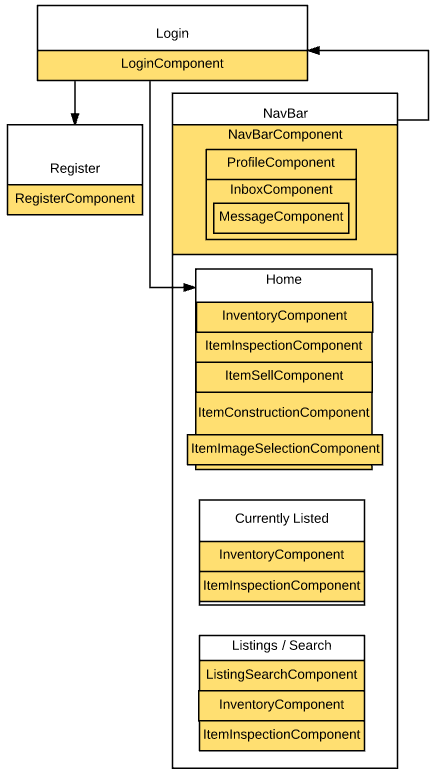
TODO:
  - Maybe we can extract InventoryComponent, ItemInspectionComponent into a global component (e.g. similar to navbar)

### Wireframes and Descriptions
TODO: find a website that can do this better than PowerPoint

Note: These wireframes may have outdated terminology or functionality and serve as a rough guide and motivation for initial design of the front-end.

#### Login Page
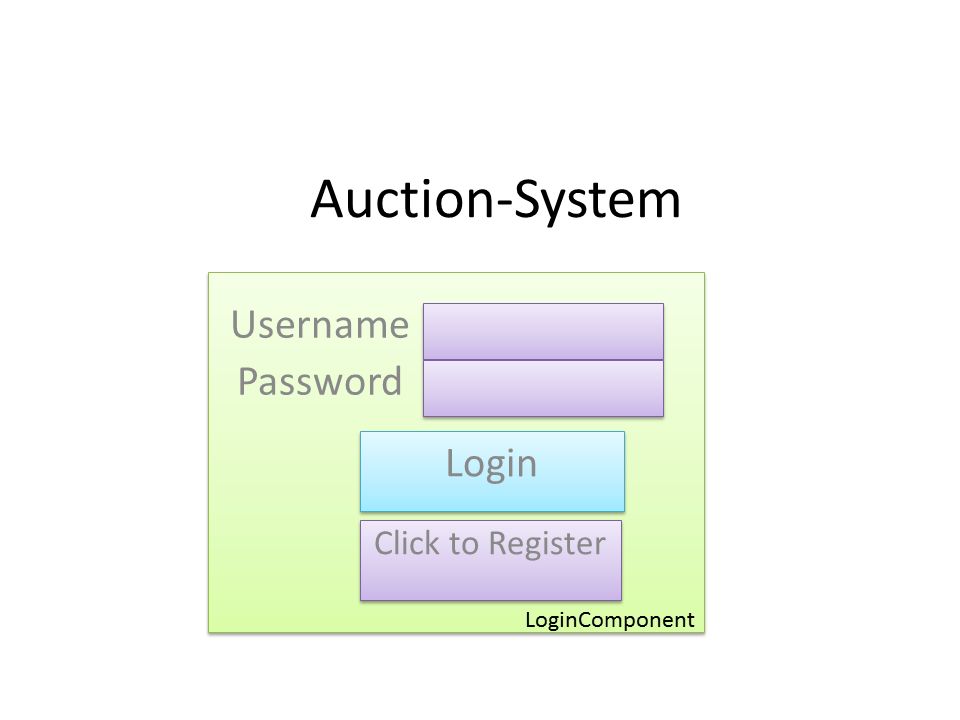

#### Register Page
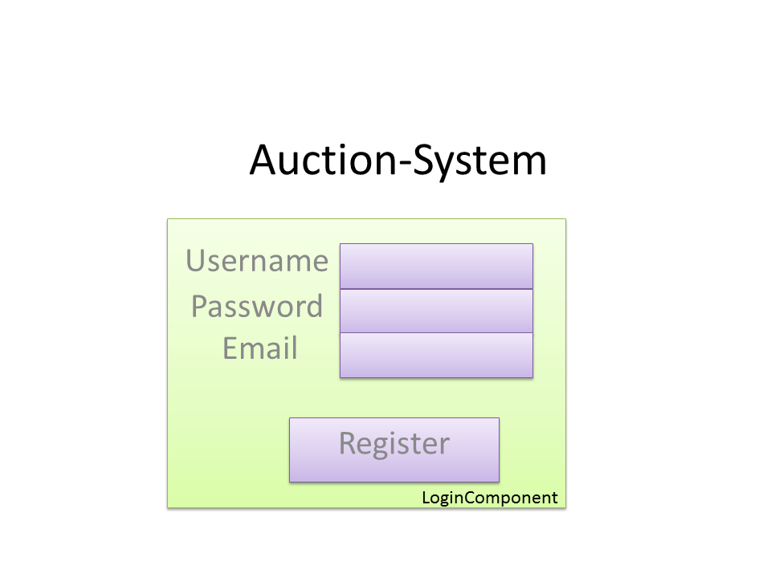

#### Landing/Profile Page - Focus on mail and profile view
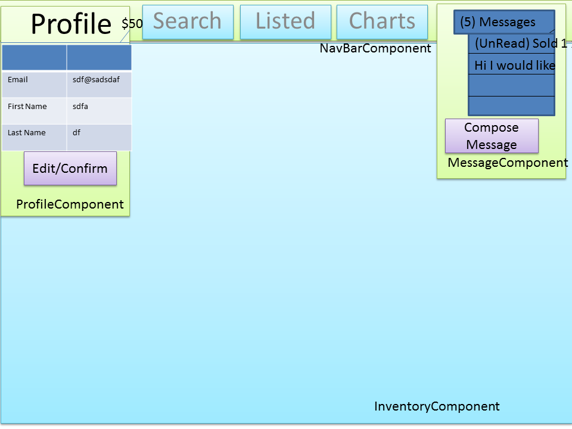
TODO: change messageComponent -> InboxComponent

#### Landing/Profile Page - Focus on message view


#### Landing/Profile Page - Focus on message view
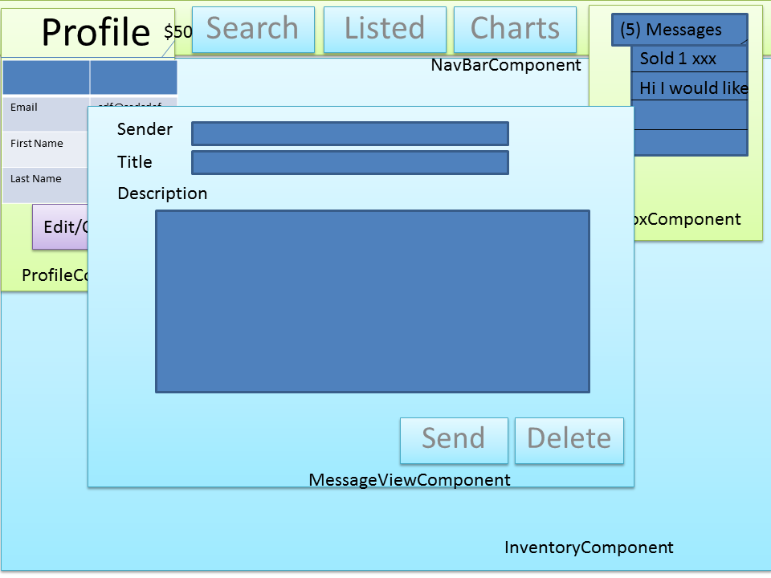

#### Landing/Profile Page - Focus on inventory
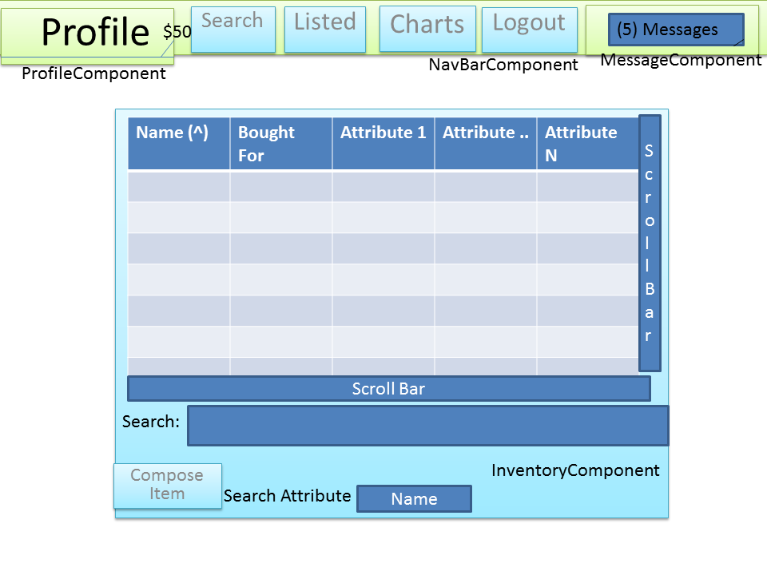

#### Landing/Profile Page - Focus on inventory search
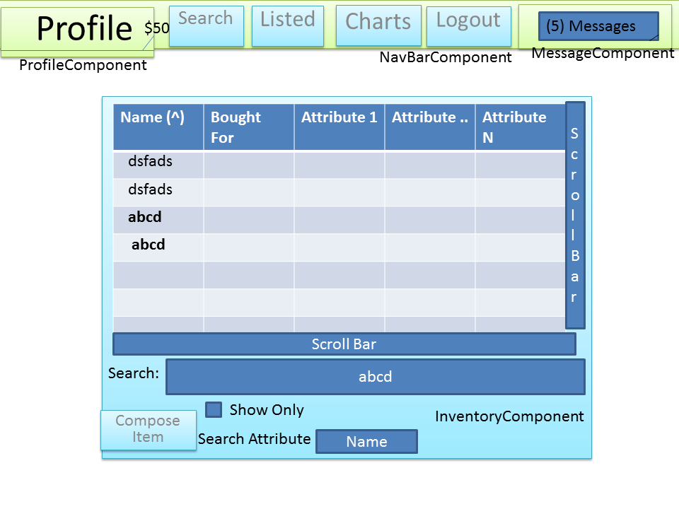

#### Landing/Profile Page - Focus on item inspection view
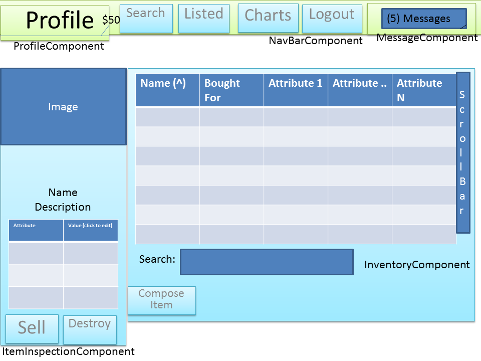

#### Landing/Profile Page - Focus on item sell
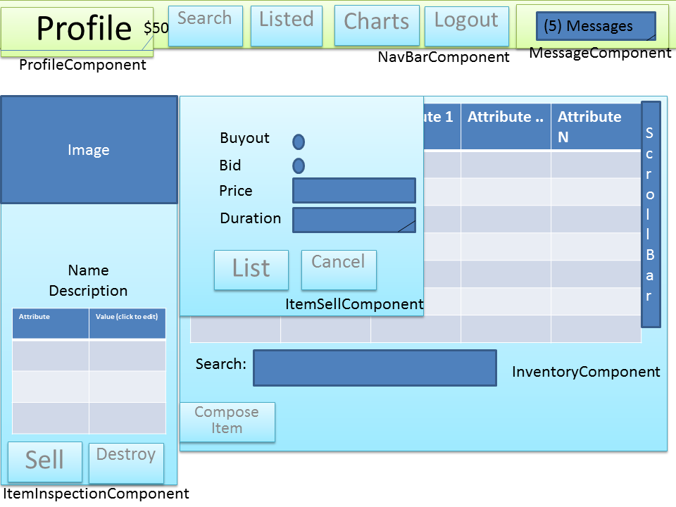

#### Listing Page
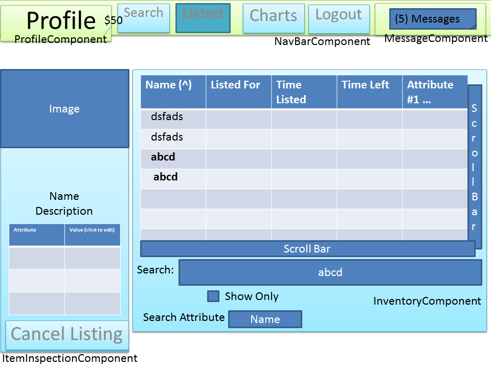

#### Landing/Profile Page - Focus on item construction view
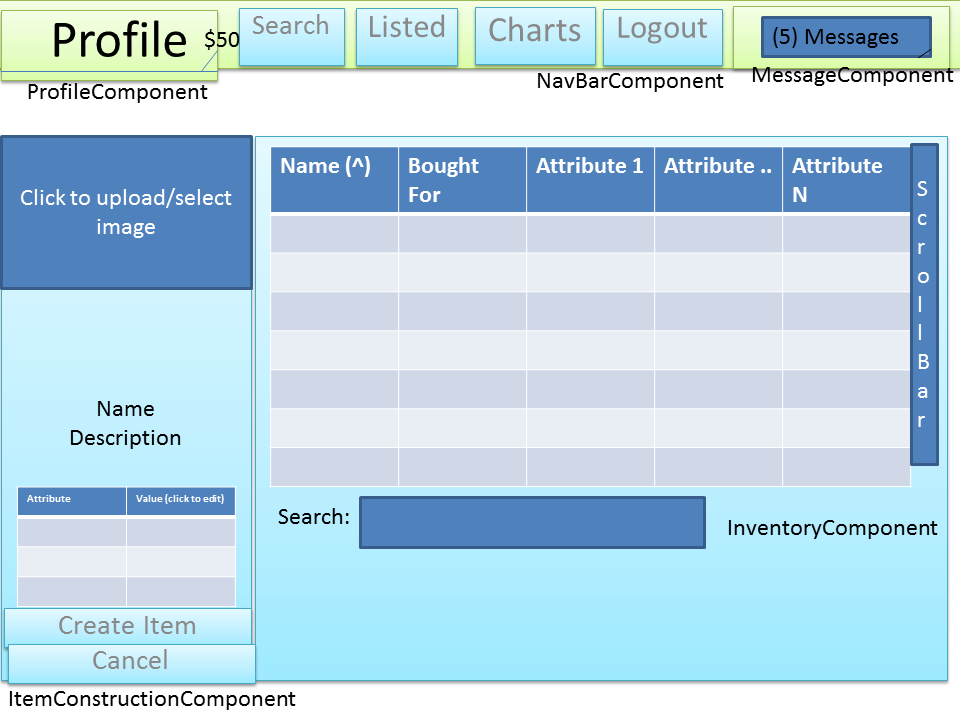

#### Landing/Profile Page - Focus on item image selection
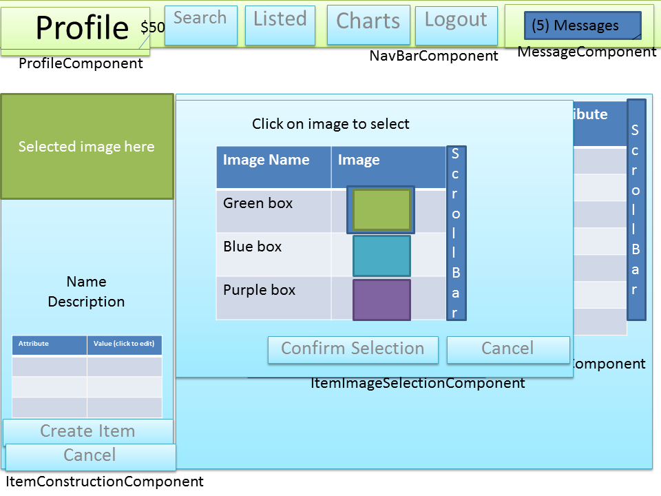

#### Search - Buy Item
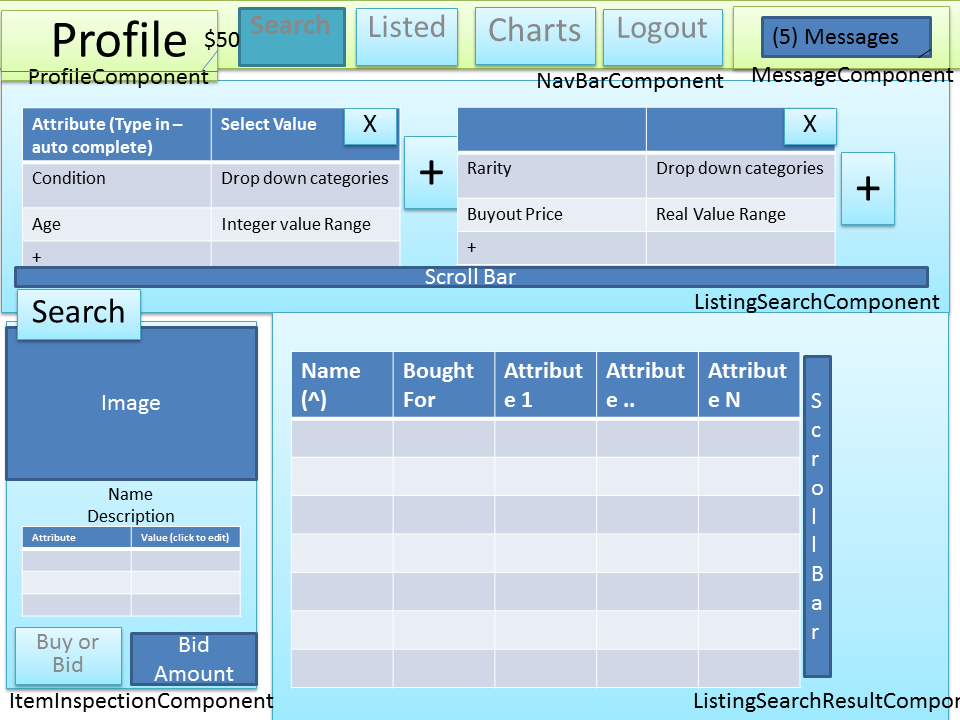

### Component List
This is a list of all the frontend components, a grouping of functionality for a related tasks. Components can be broken down into classes. Unless explicitly stated otherwise, all data validation is done server-side and likewise, all data that is displayed is generated server-side.

TODO: update collaborators lists
 - Check for feeback of actions (e.g. popup saying message sent...)
 - Think about server/client functionality split

#### LoginComponent
- **Description:** Where the user logs in
- **Parent:** None
- **Child:** None
- **Responsibilities | Collaborators:**
  - Collect login information from user
  - Display login success feedback from server
  - Navigate to landing page when ok'd by the server
  - Navigate to the register page

#### RegisterComponent
- **Description:** Where the user registers a new account
- **Parent:** None
- **Child:** None
- **Responsibilities | Collaborators:**
  - Collect account information from user
  - Display account creation feedback from server
  - Navigate to the login page
  - Can cancel

#### ProfileComponent
- **Description:** Displays information about the users profile
- **Parent:** NavBarComponent
- **Child:** None
- **Responsibilities | Collaborators:**
  - Display a scrollable list of information about the users account
  - Handle edit button
  - Handle confirm button
  - Make attributes editable when edit is pressed
  - Collect modified attribute values when confirm is pressed
  - Expand when profile nav-bar tag is pressed | NavBarComponent

#### NavBarComponent
- **Description:** The navigation bar, present on each page, allows navigation to other pages
- **Parent:** None
- **Child:** ProfileComponent, InboxComponent
- **Responsibilities | Collaborators:**
  - Allows the user to expand profile and inbox components | ProfileComponent, InboxComponent
  - Allows the user to navigate to the main app pages
  - Displays the users current amount of money

#### InboxComponent
- **Description:** Shows recent messages in a list and unread messages as notifications
- **Parent:** NavBarComponent
- **Child:** None
- **Responsibilities | Collaborators:**
   - Display number of unread messages as notification
   - Display scrollable list of messages, and label unread
   - Update noficiation count and message list when server requires
   - Expand/Contract when message nav-bar tag is pressed | NavBarComponent
   - Show message view when clicked | MessageComponent
   - Bringup compose message window when button pressed | MessageComponent

#### MessageComponent
- **Description:** A view to read/edit message contents
- **Parent:** None
- **Child:** None
- **Responsibilities | Collaborators:**
  - Display who the message was from
  - Display the title of the message
  - Notify the server that the message was read
  - Allow repling to message
  - Fields are editable in compose mode
  - Can send message (in compose mode)
  - Can delete message
  - Can cancel / exit view
  - Displays feedback about sending message

#### InventoryComponent
- **Description:** A sortable and searchable list of the items the user owns
- **Parent:** None
- **Child:** None
- **Responsibilities | Collaborators:**
  - Display a scrollable table of item rows with item attributes as columns
  - Order list asc/desc when attribute header is clicked, and change attribute label
  - collect search text from user
  - collect type of attribute to search by
  - collect whether to highlight or filer
  - highlight or selectively show items that match search criteria
  - open ItemConstructionComponent when compose item button is clicked | ItemConstructionComponent
  - open to ItemInspectionComponent when item is clicked | ItemInspectionComponent
  - knows what items to display dependant on page | NavBarComponent

#### ItemInspectionComponent
- **Description:** A widget to show more information about and item and enable actions
- **Parent:** None
- **Child:** None
- **Responsibilities | Collaborators:**
  - Display an image for the item
  - Updates when an item is clicked | InventoryComponent
  - Knows which item to display
  - Displays item name / description
  - Displays item attributes in scrollable list
  - Knows what page the user is on and updates content | NavBarComponent
  - shows sell dialog when 'sell' is clicked | ItemSellComponent
  - destroys item (after confirmation) when destroy is clicked
  - removes item from listing when 'cancel listing' is clicked

#### ItemSellComponent
- **Description:** A dialog to list an item for sale
- **Parent:** None
- **Child:** None
- **Responsibilities | Collaborators:**
  - Knows what item is being sold | ItemInspectionComponent
  - Collects whether user wants to buyout or bid
  - Collects price
  - Collects duration if bid selected using dropdown selection
  - Lists the item after confirmation when list is clicked
  - Is hidden when cancel is clicked

#### ItemConstructionComponent
- **Description:** Dialog to create new items
- **Parent:** None
- **Child:** None
- **Responsibilities | Collaborators:**
  - Display an image for the item
  - Opens the image selection dialog when the image is clicked | ItemImageSelectionComponent
  - Knows which item to display
  - Collects item name and description
  - Displays item attributes in scrollable list
  - Collects additional attributes and adds to list
  - Collects modifications to attribute values
  - Creates the item after confirmation when 'Create Item' is clicked
  - Is hidden when cancel is clicked

TODO: this is mostly duplicated from ItemInspectionComponent

#### ItemImageSelectionComponent
- **Description:** To select the items display picture
- **Parent:** None
- **Child:** None
- **Responsibilities | Collaborators:**
  - Displays a scrollable list containing all available item images
  - Collects the image to be used when an image is clicked
  - Highlights the clicked image
  - Updates the item image after 'Confirm Selection' is clicked | ItemConstructionComponent
  - Is hidden when cancel is clicked

#### ListingSearchComponent
- **Description:** Allows the creation of a custom search query to search all of the listed items up for sale
- **Parent:** None
- **Child:** None
- **Responsibilities | Collaborators:**
  - Collects a series of queries whose results are intersected or unioned
  - Allows attributes to be added to queries
  - Collects values and ranges for attributes
  - The list of queries can be scrolled
  - A search is conducted when 'search' is clicked | ListingSearchResultComponent
  - Queries can be removed when the 'x' button is clicked

#### ListingSearchResultComponent
TODO: Cut this, its the same as InventoryComponent

### Use Cases
