# Technical Design Document

TODO: how to explicitly link SRS to TDD and then create tickets for development?

http://www.in.gov/fssa/files/QualCheck.pdf
http://www.engr.sjsu.edu/gaojerry/course/131/SampleProjects/Design_Doc.pdf

## Abstract
This document is aiming to explain the static and dynamic structure of the systems architecture. Focus will be on explaining these details abstractly, and without much explanation in terms of implementation details e.g. programming language or frameworks.

## Problem Analysis
### Goals, Benefits, Objectives
- Goal is to gain experience working with multiple systems

### Description of requirements
- User can create an account to interact with the system (logging in/out) and call also message other accounts.
- User can create items, which are then stored in the users inventory. Inventories can be sorted and searched. Items can be inspected to see their component attributes.
- User can list singular items for sale as a bid and/or a buyout listing. They can also cancel listings. Users will be alerted by a message when an item is sold.
- User can search all listed items using item attributes as search criteria. They can also create on-going searches which will display items as they are listed in real time if they match criteria. The search results can be sorted. Item-type price can be observed over time

### Assumptions
### Simplifications

## Systems Overview
### Diagram
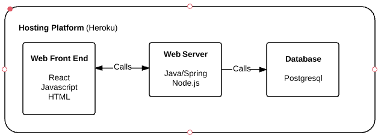
TODO: Update this to reflect technologies research page
### Justification

## Back-End
### Data Model

https://www.lucidchart.com/documents/edit/299c93a7-91aa-4bd3-b2d2-2c8fcfa3b7c4#
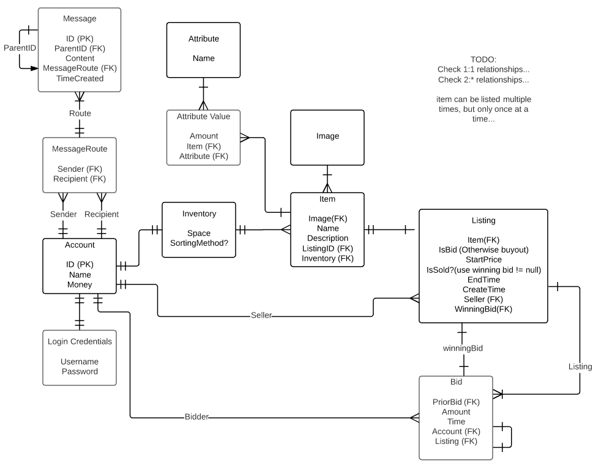
TODO:
- change AttributeValue : amount -> value, also add AttributeValue.type (e.g. enum, int, real etc...)
- Item aquired date (from buying or constructing)

### Candidate Classes
#### List
#### Diagram
https://www.lucidchart.com/documents/edit/ad45e7f3-f42b-44d3-a656-9027cd0a5a33
V2 https://www.lucidchart.com/documents/edit/0e3063df-d456-42d1-9bae-fdfd764d3fb5#
#### Justification
#### CRC cards
#### Quality, Extension, Design Patterns
### Sequence Diagrams
#### 1. Bootstrap

## Front-End
### Sitemap / Website structure
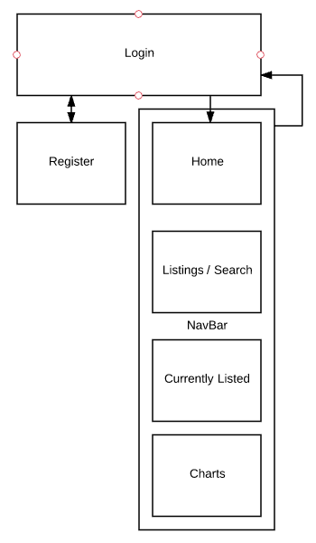

### Wireframes and Descriptions
TODO: find a website that can do this better than PowerPoint

#### Login Page
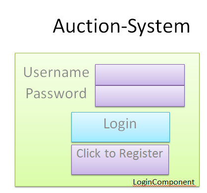

#### Landing/Profile Page - Focus on mail and profile view
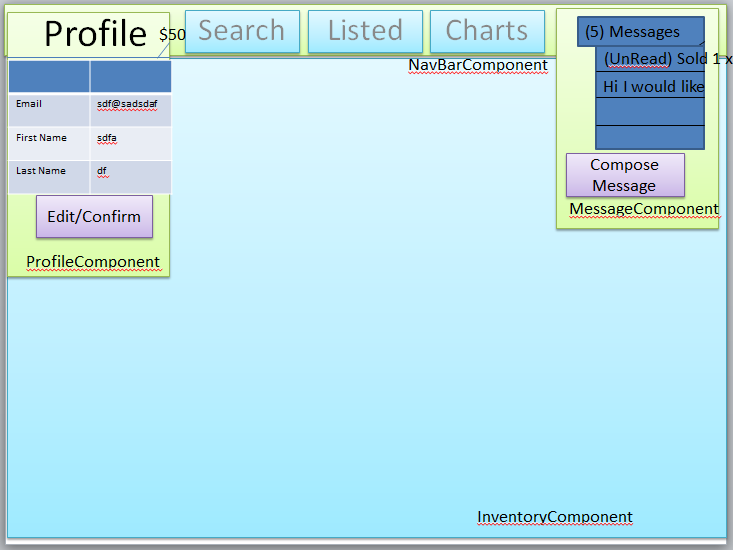

#### Landing/Profile Page - Focus on message view
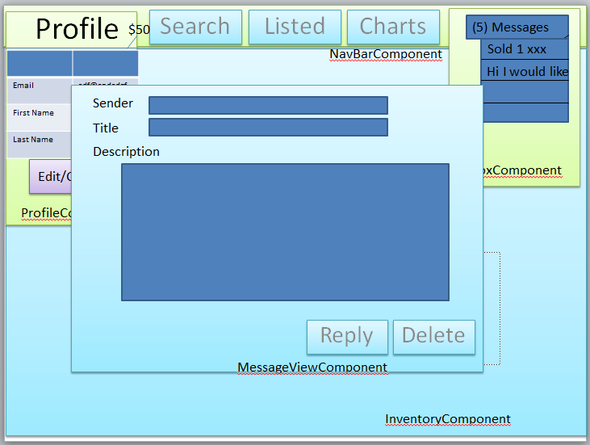

#### Landing/Profile Page - Focus on message view
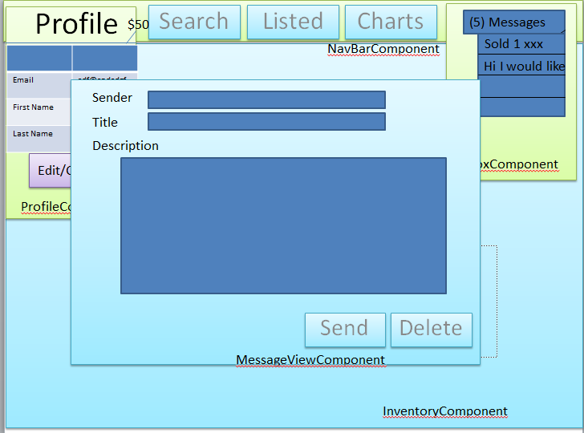

#### Landing/Profile Page - Focus on inventory
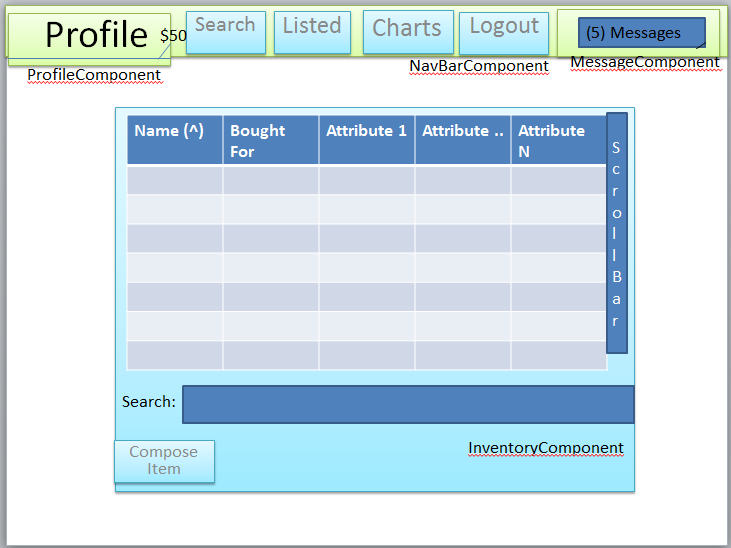

#### Landing/Profile Page - Focus on inventory search
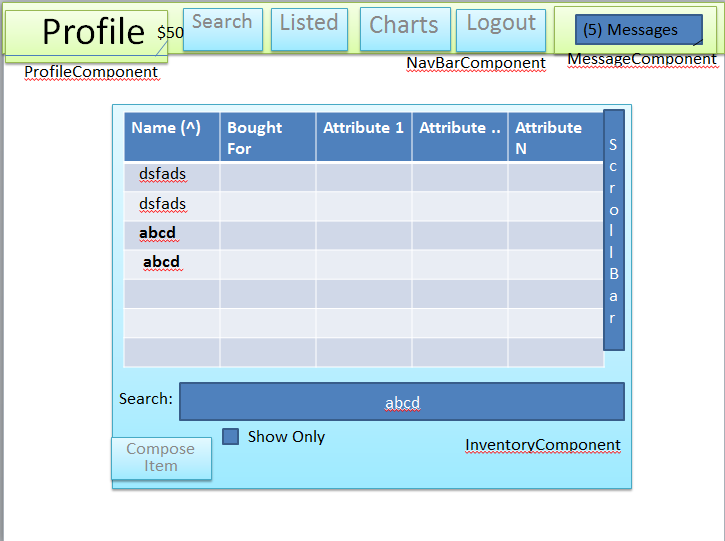

#### Landing/Profile Page - Focus on item inspection view
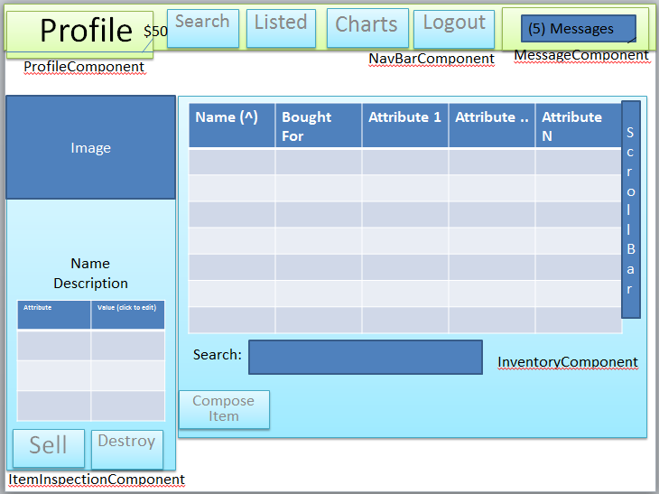

#### Landing/Profile Page - Focus on item sell
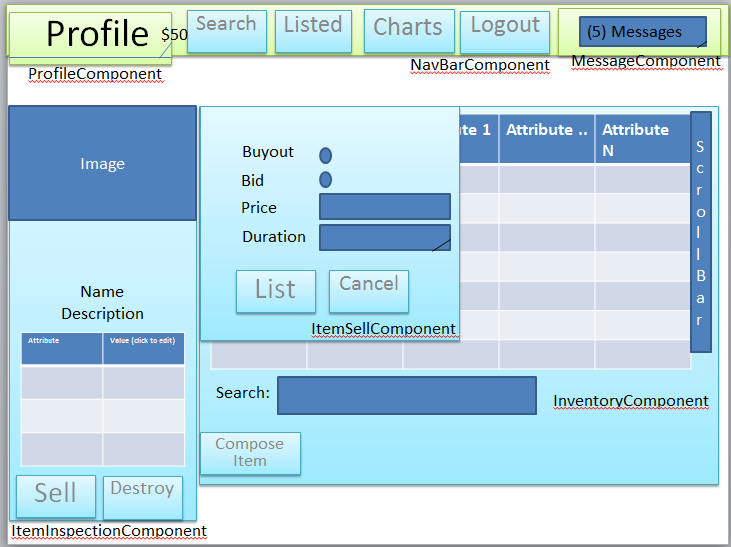

#### Landing/Profile Page - Focus on item construction view
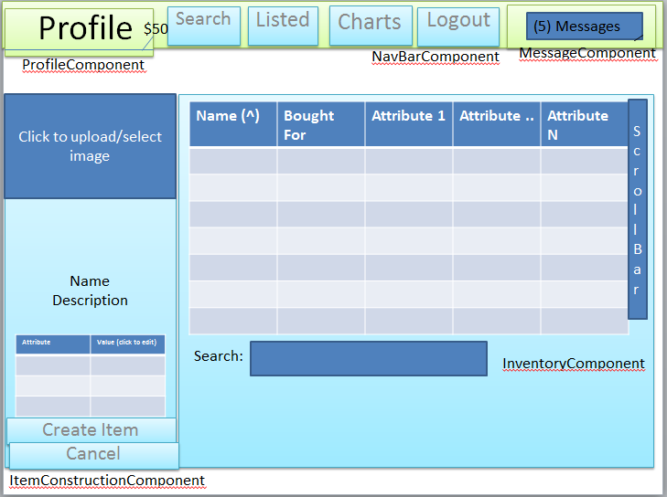

#### Landing/Profile Page - Focus on item image selection
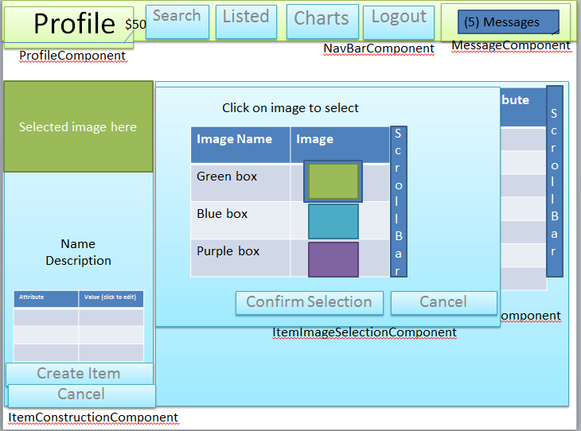

### Use Cases
