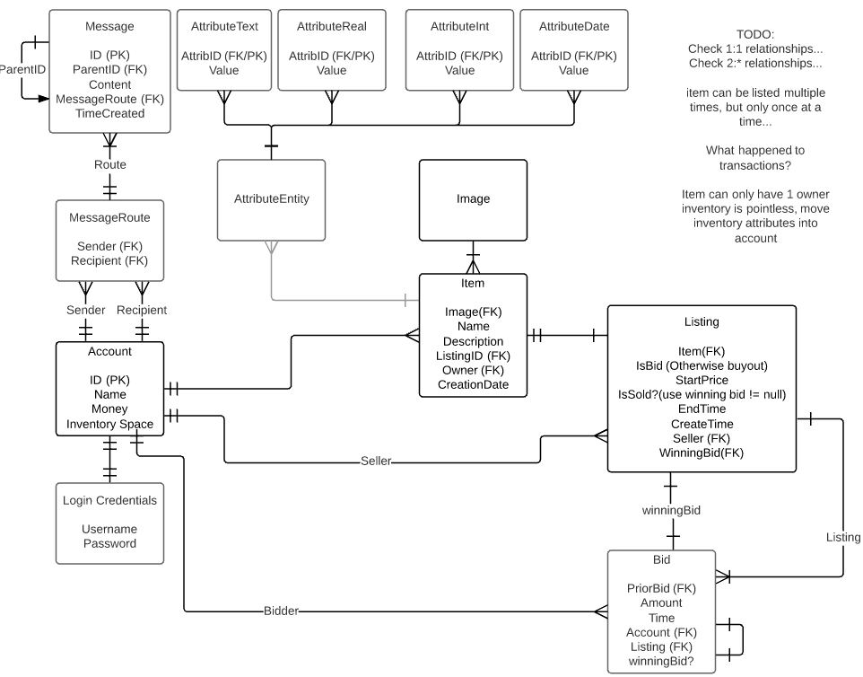
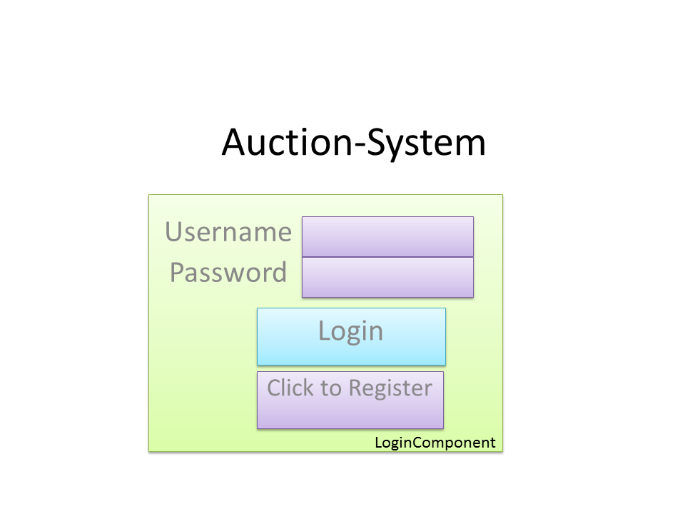
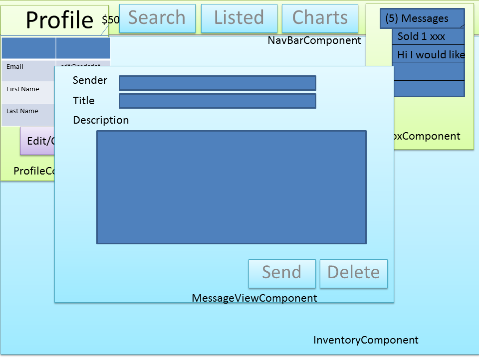
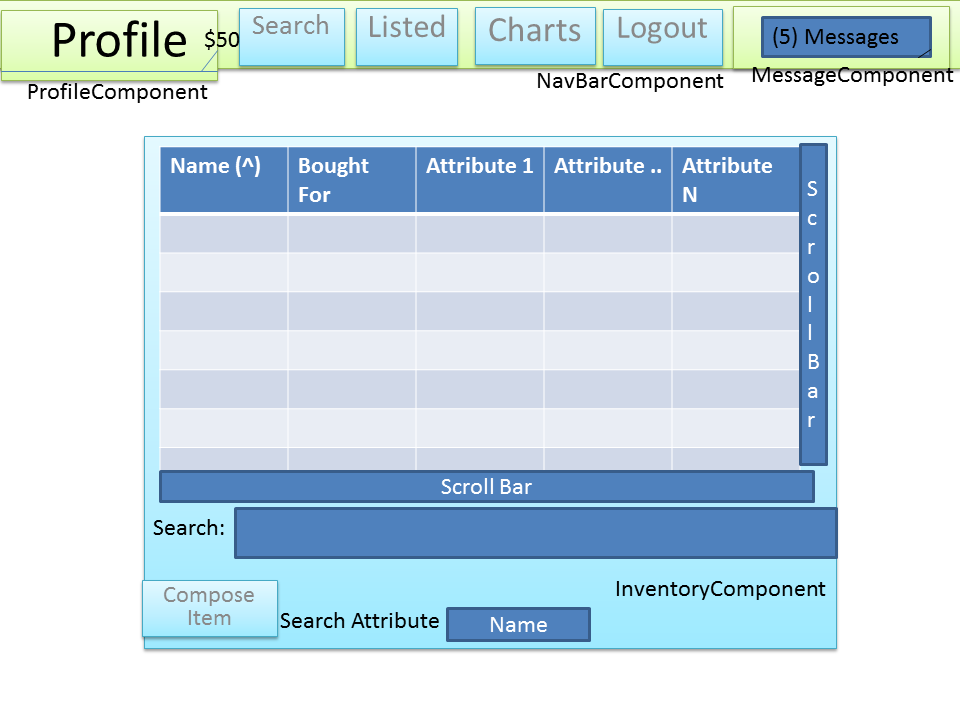
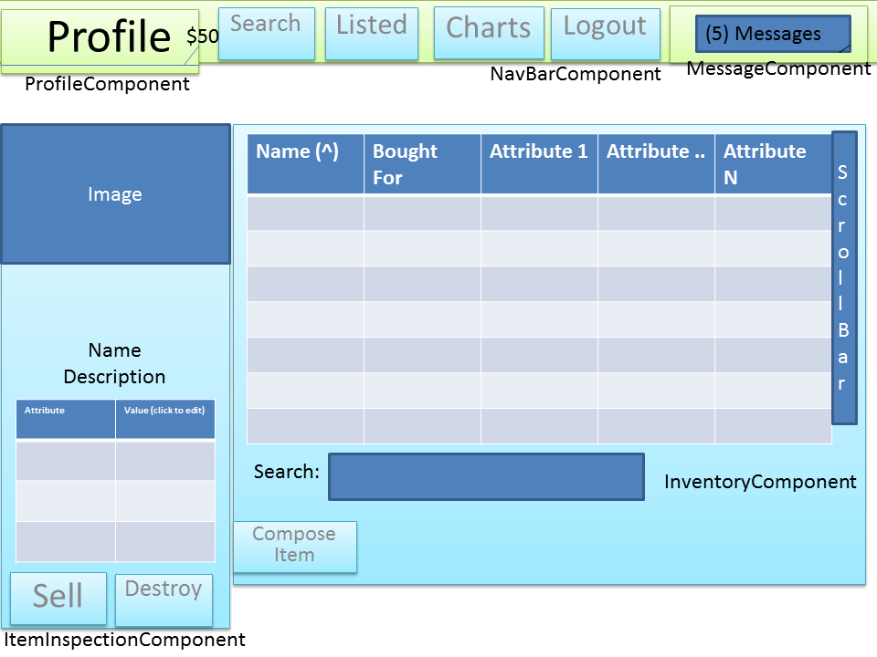
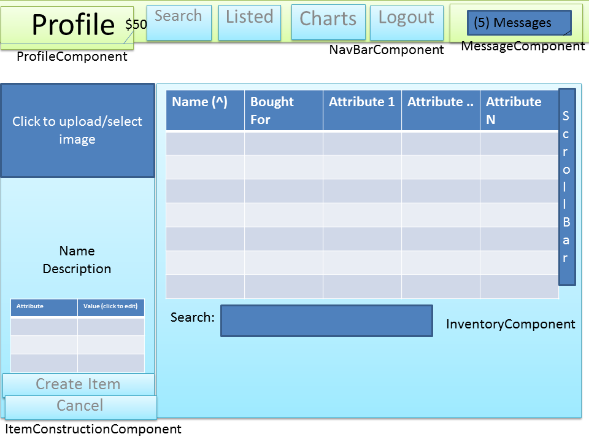
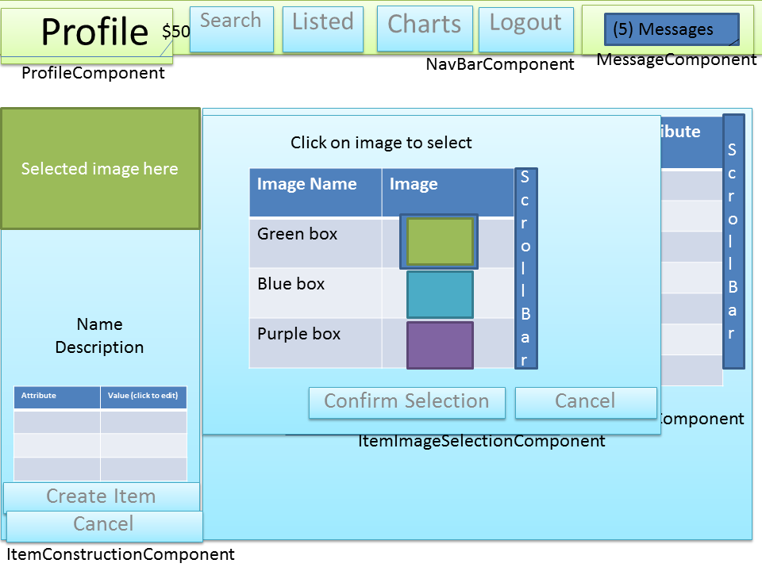
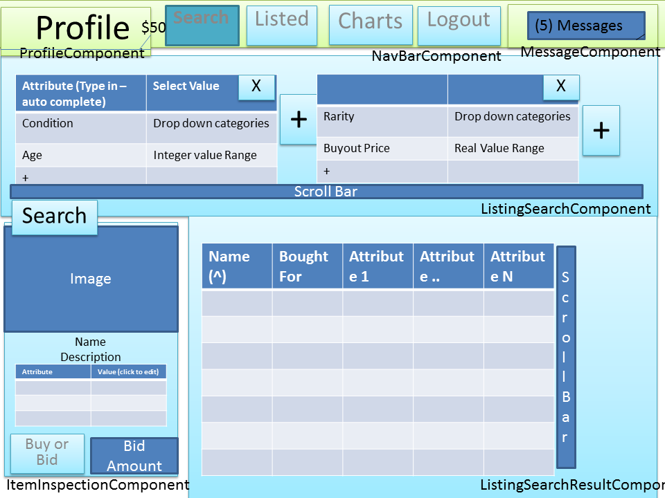

# Technical Design Document

TODO: how to explicitly link SRS to TDD and then create tickets for development?

http://www.in.gov/fssa/files/QualCheck.pdf
http://www.engr.sjsu.edu/gaojerry/course/131/SampleProjects/Design_Doc.pdf

## Abstract
This document is aiming to explain the static and dynamic structure of the systems architecture. Focus will be on explaining these details abstractly, and without much explanation in terms of implementation details e.g. programming language or frameworks.

## Problem Analysis
### Goals, Benefits, Objectives
- Goal is to gain experience working with multiple systems

### Description of requirements
- User can create an account to interact with the system (logging in/out) and call also message other accounts.
- User can create items, which are then stored in the users inventory. Inventories can be sorted and searched. Items can be inspected to see their component attributes.
- User can list singular items for sale as a bid and/or a buyout listing. They can also cancel listings. Users will be alerted by a message when an item is sold.
- User can search all listed items using item attributes as search criteria. They can also create on-going searches which will display items as they are listed in real time if they match criteria. The search results can be sorted. Item-type price can be observed over time

### Assumptions
### Simplifications

## Systems Overview
### Diagram

TODO: Update this to reflect technologies research page
### Justification

## Back-End
### Data Model

https://www.lucidchart.com/documents/edit/299c93a7-91aa-4bd3-b2d2-2c8fcfa3b7c4#

TODO:
- EAV may be an anti pattern... https://mikesmithers.wordpress.com/2013/12/22/the-anti-pattern-eavil-database-design/
### Candidate Classes
#### List
#### Diagram
https://www.lucidchart.com/documents/edit/ad45e7f3-f42b-44d3-a656-9027cd0a5a33
V2 https://www.lucidchart.com/documents/edit/0e3063df-d456-42d1-9bae-fdfd764d3fb5#
#### Justification
#### CRC cards
#### Quality, Extension, Design Patterns
### Sequence Diagrams
#### 1. Bootstrap

## Front-End
### Sitemap / Website structure

TODO: Display components under pages

### Wireframes and Descriptions
TODO: find a website that can do this better than PowerPoint

Note: These wireframes may have outdated terminology or functionality and serve as a rough guide and motivation for initial design of the front-end.

#### Login Page

#### Register Page

#### Landing/Profile Page - Focus on mail and profile view

TODO: change messageComponent -> InboxComponent

#### Landing/Profile Page - Focus on message view

#### Landing/Profile Page - Focus on message view

#### Landing/Profile Page - Focus on inventory

#### Landing/Profile Page - Focus on inventory search

#### Landing/Profile Page - Focus on item inspection view

#### Landing/Profile Page - Focus on item sell

#### Listing Page

#### Landing/Profile Page - Focus on item construction view

#### Landing/Profile Page - Focus on item image selection

#### Search - Buy Item

### Component List
This is a list of all the frontend components, a grouping of functionality for a related tasks. Components can be broken down into classes. Unless explicitly stated otherwise, all data validation is done server-side and likewise, all data that is displayed is generated server-side.

TODO: update collaborators lists

#### LoginComponent
- **Description:** Where the user logs in
- **Parent:** None
- **Child:** None
- **Responsibilities | Collaborators:**
  - Collect login information from user
  - Display login success feedback from server
  - Navigate to landing page when ok'd by the server
  - Navigate to the register page

#### RegisterComponent
- **Description:** Where the user registers a new account
- **Parent:** None
- **Child:** None
- **Responsibilities | Collaborators:**
  - Collect account information from user
  - Display account creation feedback from server
  - Navigate to the login page

#### ProfileComponent
- **Description:** Displays information about the users profile
- **Parent:** NavBarComponent
- **Child:** None
- **Responsibilities | Collaborators:**
  - Display a scrollable list of information about the users account
  - Handle edit button
  - Handle confirm button
  - Make attributes editable when edit is pressed
  - Collect modified attribute values when confirm is pressed
  - Expand when profile nav-bar tag is pressed | NavBarComponent

#### NavBarComponent
- **Description:** The navigation bar, present on each page, allows navigation to other pages
- **Parent:** None
- **Child:** ProfileComponent, InboxComponent
- **Responsibilities | Collaborators:**
  - Allows the user to expand profile and inbox components | ProfileComponent, InboxComponent
  - Allows the user to navigate to the main app pages
  - Displays the users current amount of money

#### InboxComponent
- **Description:** Shows recent messages in a list and unread messages as notifications
- **Parent:** NavBarComponent
- **Child:** None
- **Responsibilities | Collaborators:**
   - Display number of unread messages as notification
   - Display scrollable list of messages, and label unread
   - Update noficiation count and message list when server requires
   - Expand/Contract when message nav-bar tag is pressed | NavBarComponent
   - Show message view when clicked | MessageComponent
   - Bringup compose message window when button pressed | MessageComponent

#### MessageComponent
- **Description:** A view to read/edit message contents
- **Parent:** None
- **Child:** None
- **Responsibilities | Collaborators:**
  - 

#### InventoryComponent
- **Description:**
- **Parent:** None
- **Child:** None
- **Responsibilities | Collaborators:**

#### ItemInspectionComponent
- **Description:**
- **Parent:** None
- **Child:** None
- **Responsibilities | Collaborators:**

#### ItemSellComponent
- **Description:**
- **Parent:** None
- **Child:** None
- **Responsibilities | Collaborators:**

#### ItemConstructionComponent
- **Description:**
- **Parent:** None
- **Child:** None
- **Responsibilities | Collaborators:**

#### ItemImageSelectionComponent
- **Description:**
- **Parent:** None
- **Child:** None
- **Responsibilities | Collaborators:**

#### ListingSearchComponent
- **Description:**
- **Parent:** None
- **Child:** None
- **Responsibilities | Collaborators:**

#### ListingSearchResultComponent
- **Description:**
- **Parent:** None
- **Child:** None
- **Responsibilities | Collaborators:**

### Use Cases
